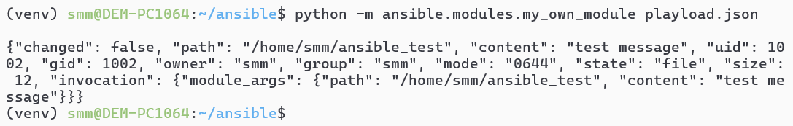
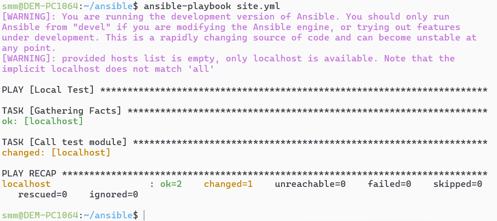
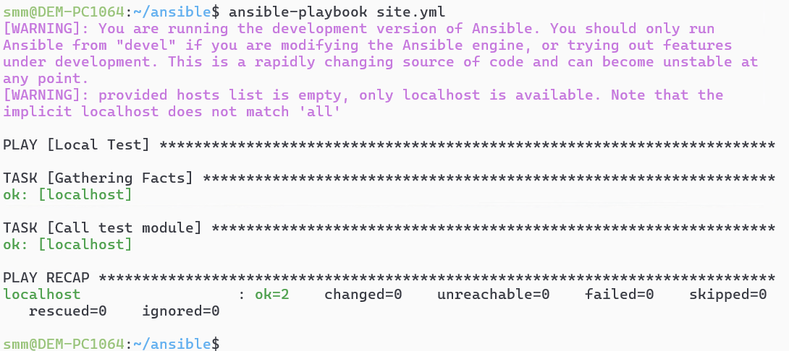

# Домашнее задание к занятию 6 «Создание собственных модулей»- Михалёв сергей

## Подготовка к выполнению

1. Создайте пустой публичный репозиторий в своём любом проекте: `my_own_collection`.
2. Скачайте репозиторий Ansible: `git clone https://github.com/ansible/ansible.git` по любому, удобному вам пути.
3. Зайдите в директорию Ansible: `cd ansible`.
4. Создайте виртуальное окружение: `python3 -m venv venv`.
5. Активируйте виртуальное окружение: `. venv/bin/activate`. Дальнейшие действия производятся только в виртуальном окружении.
6. Установите зависимости `pip install -r requirements.txt`.
7. Запустите настройку окружения `. hacking/env-setup`.
8. Если все шаги прошли успешно — выйдите из виртуального окружения `deactivate`.
9. Ваше окружение настроено. Чтобы запустить его, нужно находиться в директории `ansible` и выполнить конструкцию `. venv/bin/activate && . hacking/env-setup`.

## Основная часть

Ваша цель — написать собственный module, который вы можете использовать в своей role через playbook. Всё это должно быть собрано в виде collection и отправлено в ваш репозиторий.

**Шаг 1.** В виртуальном окружении создайте новый `my_own_module.py` файл.

**Шаг 2.** Наполните его содержимым.

**Шаг 3.** Заполните файл в соответствии с требованиями Ansible так, чтобы он выполнял основную задачу: module должен создавать текстовый файл на удалённом хосте по пути, определённом в параметре `path`, с содержимым, определённым в параметре `content`.

**Решение**
[my_own_module.py](my_own_module.py)

**Шаг 4.** Проверьте module на исполняемость локально.

**Решение**
*Проверка module на исполняемость локально*</br>
   </br>

**Шаг 5.** Напишите single task playbook и используйте module в нём.

**Решение**
single task playbook:
```
---
- name: Local Test
  hosts: localhost
  tasks:
    - name: Call test module
      my_own_module: 
        path: /tmp/ansible_test
        content: test message
```

*Результат запуска playbook*</br>
   </br>
   
**Шаг 6.** Проверьте через playbook на идемпотентность.

**Решение**

*Повторный запуск не приводит к каким-либо изменениям*</br>
   </br>

**Шаг 7.** Выйдите из виртуального окружения.

**Шаг 8.** Инициализируйте новую collection: `ansible-galaxy collection init my_own_namespace.yandex_cloud_elk`.

**Шаг 9.** В эту collection перенесите свой module в соответствующую директорию.

**Шаг 10.** Single task playbook преобразуйте в single task role и перенесите в collection. У role должны быть default всех параметров module.

**Шаг 11.** Создайте playbook для использования этой role.

**Шаг 12.** Заполните всю документацию по collection, выложите в свой репозиторий, поставьте тег `1.0.0` на этот коммит.

**Шаг 13.** Создайте .tar.gz этой collection: `ansible-galaxy collection build` в корневой директории collection.

**Шаг 14.** Создайте ещё одну директорию любого наименования, перенесите туда single task playbook и архив c collection.

**Шаг 15.** Установите collection из локального архива: `ansible-galaxy collection install <archivename>.tar.gz`.

**Шаг 16.** Запустите playbook, убедитесь, что он работает.

**Шаг 17.** В ответ необходимо прислать ссылки на collection и tar.gz архив, а также скриншоты выполнения пунктов 4, 6, 15 и 16.

## Необязательная часть

1. Реализуйте свой модуль для создания хостов в Yandex Cloud.
2. Модуль может и должен иметь зависимость от `yc`, основной функционал: создание ВМ с нужным сайзингом на основе нужной ОС. Дополнительные модули по созданию кластеров ClickHouse, MySQL и прочего реализовывать не надо, достаточно простейшего создания ВМ.
3. Модуль может формировать динамическое inventory, но эта часть не является обязательной, достаточно, чтобы он делал хосты с указанной спецификацией в YAML.
4. Протестируйте модуль на идемпотентность, исполнимость. При успехе добавьте этот модуль в свою коллекцию.
5. Измените playbook так, чтобы он умел создавать инфраструктуру под inventory, а после устанавливал весь ваш стек Observability на нужные хосты и настраивал его.
6. В итоге ваша коллекция обязательно должна содержать: clickhouse-role (если есть своя), lighthouse-role, vector-role, два модуля: my_own_module и модуль управления Yandex Cloud хостами и playbook, который демонстрирует создание Observability стека.

**Решение**
Модуль.

```python
#!/usr/bin/python

# Copyright: (c) 2018, Terry Jones <terry.jones@example.org>
# GNU General Public License v3.0+ (see COPYING or https://www.gnu.org/licenses/gpl-3.0.txt)
from __future__ import (absolute_import, division, print_function)
__metaclass__ = type

DOCUMENTATION = r'''
---
module: my_file_creator

short_description: This module creates a file with specified content on the remote host.

version_added: "1.0.0"

description: This module allows you to create a file on the remote host with content specified by the user.

options:
    path:
        description: The full path where the file will be created.
        required: true
        type: str
    content:
        description: The content to write into the file.
        required: true
        type: str

author:
    - Your Name (@yourGitHubHandle)
'''

EXAMPLES = r'''
# Create a file with the given content
- name: Create a file on the remote host
  my_namespace.my_collection.my_file_creator:
    path: /tmp/myfile.txt
    content: Hello, World!

# Create another file with different content
- name: Create another file
  my_namespace.my_collection.my_file_creator:
    path: /tmp/anotherfile.txt
    content: Ansible is awesome!
'''

RETURN = r'''
path:
    description: The path where the file was created.
    type: str
    returned: always
    sample: '/tmp/myfile.txt'
content:
    description: The content written to the file.
    type: str
    returned: always
    sample: 'Hello, World!'
changed:
    description: Whether the file was created or modified.
    type: bool
    returned: always
'''

from ansible.module_utils.basic import AnsibleModule
import os


def run_module():
    # define available arguments/parameters a user can pass to the module
    module_args = dict(
        path=dict(type='str', required=True),
        content=dict(type='str', required=True)
    )

    # seed the result dict in the object
    result = dict(
        changed=False,
        path='',
        content=''
    )

    # create the AnsibleModule object
    module = AnsibleModule(
        argument_spec=module_args,
        supports_check_mode=True
    )

    path = module.params['path']
    content = module.params['content']

    # if check mode is on, return current state without making changes
    if module.check_mode:
        result['path'] = path
        result['content'] = content
        module.exit_json(**result)

    # Check if the file already exists and has the same content
    if os.path.exists(path):
        with open(path, 'r') as file:
            existing_content = file.read()
        if existing_content == content:
            result['path'] = path
            result['content'] = content
            module.exit_json(**result)

    # Write the content to the file
    try:
        with open(path, 'w') as file:
            file.write(content)
        result['changed'] = True
        result['path'] = path
        result['content'] = content
    except Exception as e:
        module.fail_json(msg=f"Failed to write to file: {str(e)}", **result)

    # exit with the result
    module.exit_json(**result)


def main():
    run_module()


if __name__ == '__main__':
    main()
```

---

### Как оформить решение задания

Выполненное домашнее задание пришлите в виде ссылки на .md-файл в вашем репозитории.

---
