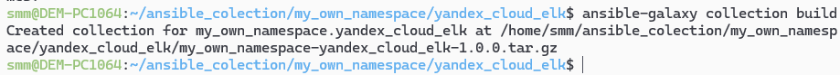

# Домашнее задание к занятию 6 «Создание собственных модулей»- Михалёв сергей

## Подготовка к выполнению

1. Создайте пустой публичный репозиторий в своём любом проекте: `my_own_collection`.
2. Скачайте репозиторий Ansible: `git clone https://github.com/ansible/ansible.git` по любому, удобному вам пути.
3. Зайдите в директорию Ansible: `cd ansible`.
4. Создайте виртуальное окружение: `python3 -m venv venv`.
5. Активируйте виртуальное окружение: `. venv/bin/activate`. Дальнейшие действия производятся только в виртуальном окружении.
6. Установите зависимости `pip install -r requirements.txt`.
7. Запустите настройку окружения `. hacking/env-setup`.
8. Если все шаги прошли успешно — выйдите из виртуального окружения `deactivate`.
9. Ваше окружение настроено. Чтобы запустить его, нужно находиться в директории `ansible` и выполнить конструкцию `. venv/bin/activate && . hacking/env-setup`.

---

## Основная часть

Ваша цель — написать собственный module, который вы можете использовать в своей role через playbook. Всё это должно быть собрано в виде collection и отправлено в ваш репозиторий.

**Шаг 1.** В виртуальном окружении создайте новый `my_own_module.py` файл.

**Шаг 2.** Наполните его содержимым.

**Шаг 3.** Заполните файл в соответствии с требованиями Ansible так, чтобы он выполнял основную задачу: module должен создавать текстовый файл на удалённом хосте по пути, определённом в параметре `path`, с содержимым, определённым в параметре `content`.

**Решение**

Создал файл [my_own_module.py](my_own_module.py) и наполнил рабочим кодом.

**Шаг 4.** Проверьте module на исполняемость локально.

**Решение**

*Проверка module на исполняемость локально*</br>
   </br>

**Шаг 5.** Напишите single task playbook и используйте module в нём.

**Решение**

Написал [single task playbook](site.yml):
```
---
- name: Local Test
  hosts: localhost
  tasks:
    - name: Call test module
      my_own_module: 
        path: /tmp/ansible_test
        content: test message
```

*Результат запуска playbook*</br>
   </br>
   
**Шаг 6.** Проверьте через playbook на идемпотентность.

**Решение**

*Повторный запуск не приводит к каким-либо изменениям*</br>
   </br>

**Шаг 7.** Выйдите из виртуального окружения.

**Шаг 8.** Инициализируйте новую collection: `ansible-galaxy collection init my_own_namespace.yandex_cloud_elk`.

*Создана коллекция*</br>
   </br>

**Шаг 9.** В эту collection перенесите свой module в соответствующую директорию.

**Решение**

*Перенёс свой module в соответствующую директорию*</br>
   </br>

**Шаг 10.** Single task playbook преобразуйте в single task role и перенесите в collection. У role должны быть default всех параметров module.

**Решение**

*Параметры, переопределяемые пользователем в role*</br>
   </br>

**Шаг 11.** Создайте playbook для использования этой role.

**Решение**

```
---
- name: Local Test
  hosts: localhost
  roles:
    - my_own_namespace.yandex_cloud_elk.my_single_role
```

**Шаг 12.** Заполните всю документацию по collection, выложите в свой репозиторий, поставьте тег `1.0.0` на этот коммит.

**Шаг 13.** Создайте .tar.gz этой collection: `ansible-galaxy collection build` в корневой директории collection.

**Решение**
*Коллекция собрана в [архив](https://github.com/sergeMMikh/hw_ansible-06-module/blob/main/my_own_namespace-yandex_cloud_elk-1.0.0.tar.gz).*</br>
   </br>

**Шаг 14.** Создайте ещё одну директорию любого наименования, перенесите туда single task playbook и архив c collection.

**Шаг 15.** Установите collection из локального архива: `ansible-galaxy collection install <archivename>.tar.gz`.

**Решение**
*Установил collection из локального архива.*</br>
   </br>

**Шаг 16.** Запустите playbook, убедитесь, что он работает.

**Решение**
*Установил collection из локального архива.*</br>
   </br>

**Шаг 17.** В ответ необходимо прислать ссылки на collection и tar.gz архив, а также скриншоты выполнения пунктов 4, 6, 15 и 16.

**Решение**

1. [Collection](https://github.com/sergeMMikh/my_own_collection)
2. [tar.gz архив](https://github.com/sergeMMikh/hw_ansible-06-module/blob/main/my_own_namespace-yandex_cloud_elk-1.0.0.tar.gz)
3. [Cкриншот выполнения пункта 4](images/Task_4.png)
4. [Cкриншот выполнения пункта 6](images/Task_5_3.png)
5. [Cкриншот выполнения пункта 15](images/Task_15.png)
6. [Cкриншот выполнения пункта 16](images/Task_16.png).

---
